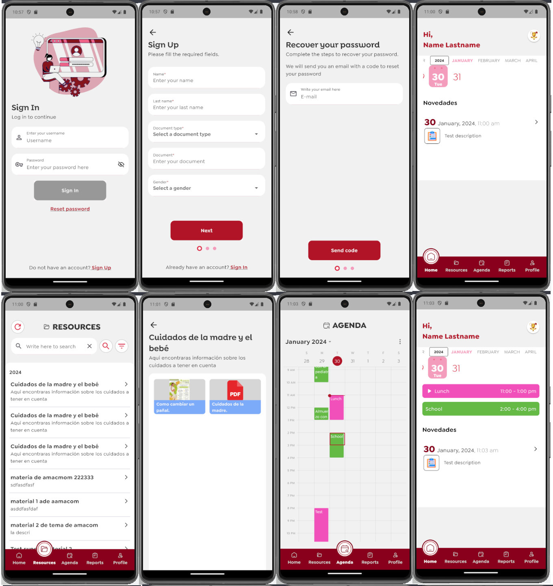
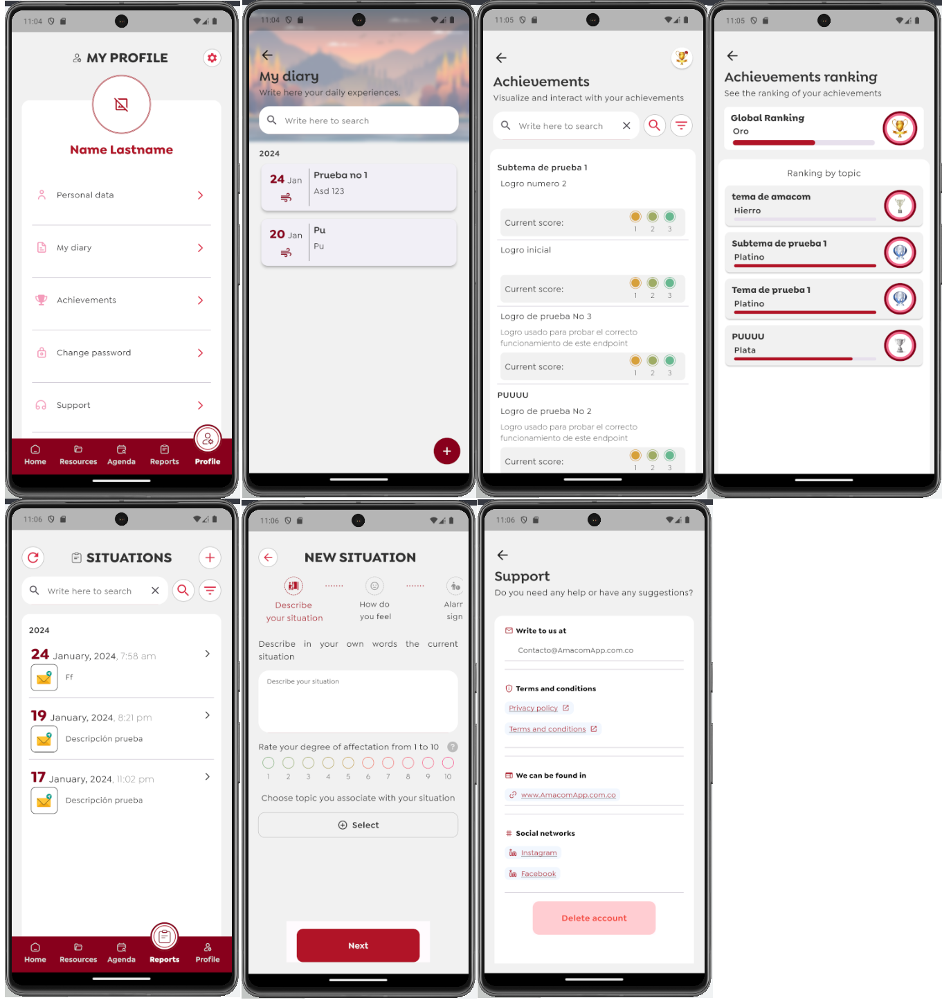
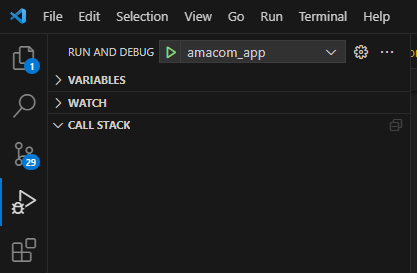

# AmacomApp

A Health App made in Flutter.






## Getting Started

This project is a starting point for a Flutter application.

A few resources to get you started if this is your first Flutter project:

- [Lab: Write your first Flutter app](https://docs.flutter.dev/get-started/codelab)
- [Cookbook: Useful Flutter samples](https://docs.flutter.dev/cookbook)

For help getting started with Flutter development, view the
[online documentation](https://docs.flutter.dev/), which offers tutorials,
samples, guidance on mobile development, and a full API reference.

---

### 1. Version Information

- Flutter Version: 3.10.2
- FVM Version: 2.4.1

Make sure to use the specified versions of Flutter and FVM to ensure compatibility with this project.

To set up Flutter with the correct version, you can use FVM (Flutter Version Management). Follow the steps below:

1. Install FVM by running the following command in your terminal:

   ```bash
   $ dart pub global activate fvm
   ```

2. Initialize FVM in your project by running the following command in your project's root directory:

   ```bash
   $ fvm init
   ```

3. Set the Flutter version for this project:

   ```bash
   $ fvm use 3.10.2
   ```

Now you have Flutter set up with the correct version for this project using FVM. You can proceed with Flutter development for this app.

For more information about FVM and its usage, refer to the [FVM documentation](https://fvm.app/).

## 2. Run Application in Development, Release or Profile mode

In order to make app run with any problems you must specify HOST url to send HTTP requests. To do that, you should define in application build environment. If you are using VSCode, add or modify ```.vscode/launch.json``` file and for the desired launch modes add the following lines with your HOST url.

   ```
   {
      "name": "amacom_app",
      "request": "launch",
      "type": "dart",
      "flutterMode": "{{desired mode}}",
      "toolArgs": [
            "--dart-define",
            "HOST={{your host url here}}",
      ],
      "args": [
            "--dart-define=HOST={{your host url here}}",
      ],
      "env": {
            "HOST": "",
      }
   }
   ```
With that you can launch the application without any problems in your device or emulator running the following command on the app root directory:
   ```bash
   $ flutter run
   ```
Or just launching it directly from VSCode



## 3. Compile application for distribution

Before any operation we must define the HOST url in app compile. If you compile directly from terminal, then you just need to add  ``--dart-define=HOST={{your host url}}`` in your compile command.

As example, here is how it should looks like for android apk build:

   ```bash
   $ flutter build apk --release --dart-define=HOST={{your host url}}
   ```

To compile app for deployment in flutter supported platforms you must follow the official guide in flutter [online documentation for deployment](https://docs.flutter.dev/deployment).